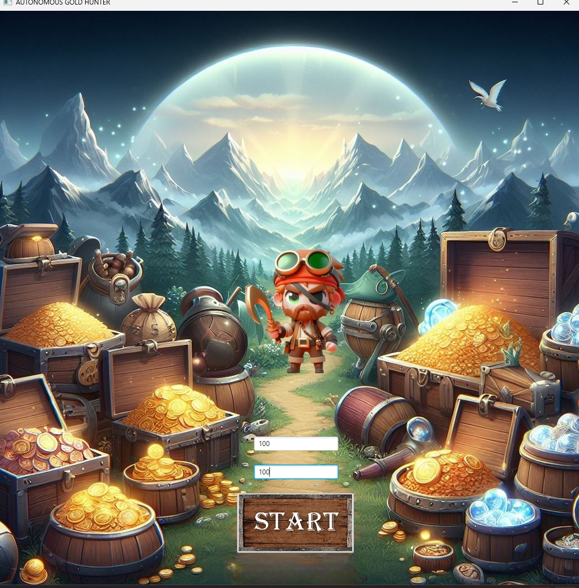
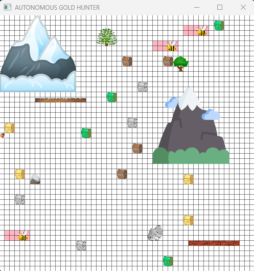
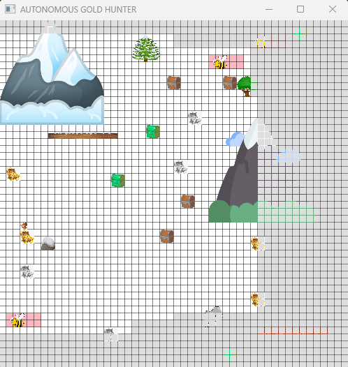

# Autonomous_Gold_Hunter
Autonom Gold Hunter project with JavaFX for School

## Purpose 
Develope with Java/OOP an pathfinding algorithm and map generator with non-coincident obstacles each other completely autonomous

## Screenshots

|                     Before Start                      |                        After Start                         |
:-----------------------------------------------------:|:----------------------------------------------------:
|  |  |
|                                                       |                                                      |